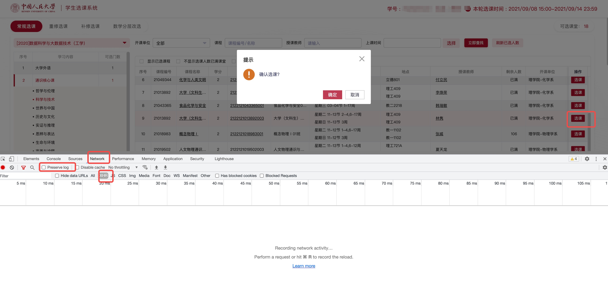
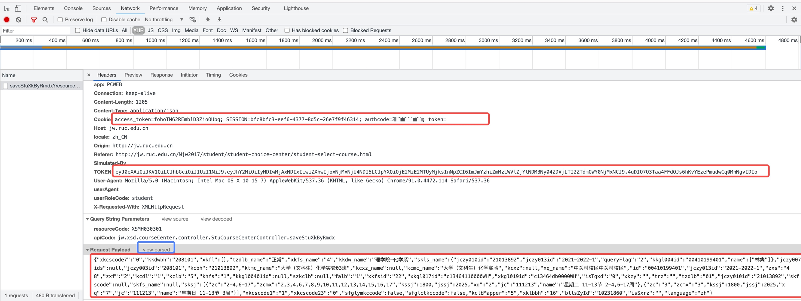
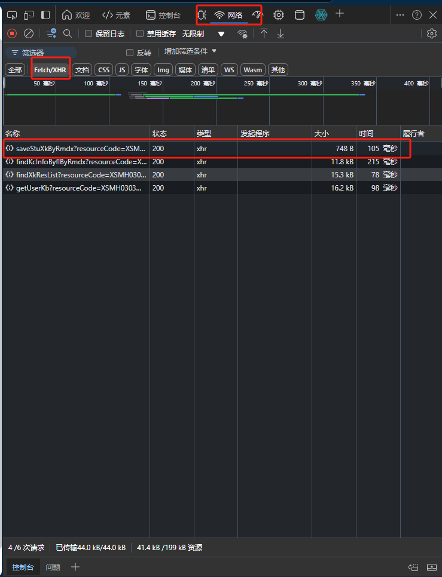
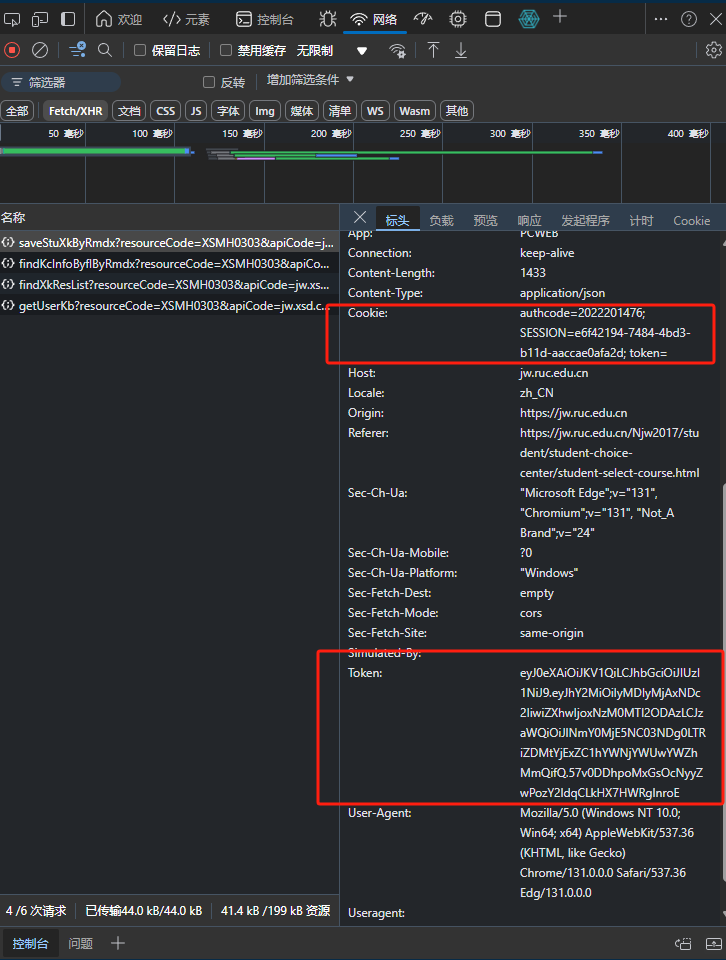
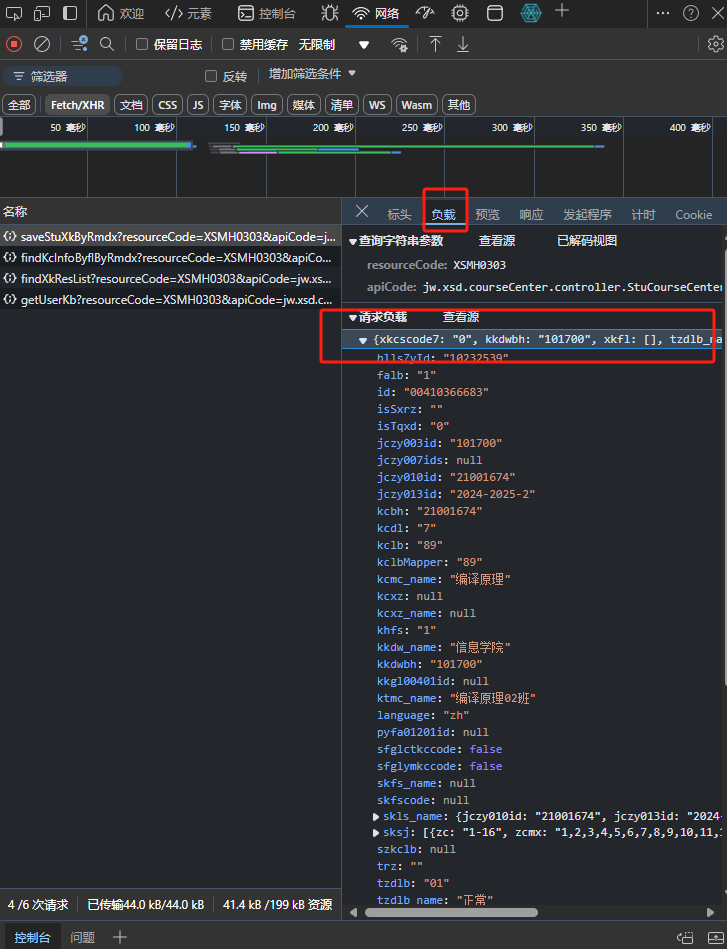

```
██████  ██    ██  ██████     ██   ██ ██   ██     
██   ██ ██    ██ ██           ██ ██  ██  ██      
██████  ██    ██ ██            ███   █████       
██   ██ ██    ██ ██           ██ ██  ██  ██      
██   ██  ██████   ██████     ██   ██ ██   ██     
                                                                                                
██   ██ ███████ ██      ██████  ███████ ██████   
██   ██ ██      ██      ██   ██ ██      ██   ██  
███████ █████   ██      ██████  █████   ██████   
██   ██ ██      ██      ██      ██      ██   ██  
██   ██ ███████ ███████ ██      ███████ ██   ██                                                                
```

# 紧急更新
由于教务处注意到有人使用选课脚本，现在不建议使用本脚本
不过据另一位脚本开发者[here](https://github.com/panjd123/RUC-CourseSelectionTool)的说法，微人大只会在整五分钟放课，这样通过检测时间可以让一个小时的请求减少到几十次的水平，从而无法分辨到底是脚本还是手点的，现在脚本已完成更新，一小时的请求数将会少于300次，完全可能是手点的。
如果你之前用过本脚本，问题应该也不大，因为相对于更广泛使用的另一个脚本，本脚本的请求频率非常低，类似于手点频率。理论上来说难以发现（脚本发送的请求和手点是一样的）。

# 使用说明
微人大课程中心自动选课器。适用于比手速抢课阶段的自动抢课。

抢课器的原理是: 模拟登录进选课系统, 然后每几秒发送一次选课请求, 直到选课成功。

祝你抢课成功，以及，**低调使用！**


## 懂如何编辑并运行python程序的建议使用源码版，即跳到本说明的【环境要求-源码版】处

# 使用说明-小白版（不支持mac）

1. 双击运行dist文件夹下的```RUCxk.exe```。

2. 在浏览器中登录选课系统后，找到你要抢的课。打开浏览器控制台（F12），切换至network模式。勾选preserve log按钮。点击“XHR”，这样会把除了XHR请求外的其他请求过滤掉，更加方便我们查看。（见下图红框处）
## chrome版：




3. 点击选课按钮，并确定。控制台中会刷出几个请求。找到以saveStu开头的那个请求，点开，如下图。




先点击右侧Request Payload旁边的view source(见上图中蓝框)，把它下面的东西转成字符串。

然后，把Cookie, TOKEN, 以及Request Payload中的内容复制下来(见上图中的三个红框)。**注意，Cookie复制的时候如果最后面是token=的话不要复制token=部分！！！复制到分号为止即可！**

再把cookie, token粘贴到RUCxk.exe窗口中对应的地方。把request_data粘贴到RUCxk.exe窗口中的任意一个```payload```处。三个payload可以同时蹲三门课，如果不需要三门可以只粘贴一个或两个payload，如果需要同时蹲更多课可以多双击运行多个窗口。
## edge版：




类似chrome版，找到后两个图中的cookie,token和请求负载(payload)，把内容粘贴到对应位置。这里的“请求负载”就是你要选的课，接下来程序会把这个请求发给微人大。

**如果你不确定你在做什么，url留空即可**

**多个payload是为了同时抢多门课，如果不用到更多课，就只粘贴一个payload**

4. 点击```开始蹲课```运行程序，如果程序在最下面的输出框中输出```正在运行中```或者```运行中，已进行xx轮```字样，则说明程序正常运行，只用最小化程序（可别关掉了）等待即可。一般而言跑一两天都能蹲到，包括烹饪课这种比较热门的课

## 解决错误
开发者已经对常见错误进行了翻译，如果有错误会提示用户进行相应操作。
如果出现```未知错误```字样，用户可尝试自己debug。程序发送请求返回的实际结果存储在程序同目录（文件夹）下的log.txt文件。


## Notes

你的登录Cookie会在一段时间后失效（多少时间具有随机性，一般是10-20个小时左右）。因此，需要时不时手动更新cookie和token。
# 使用说明-源码版

环境要求：Python3，requests库
使用
```py
pip install requests -i https://pypi.tuna.tsinghua.edu.cn/simple
```
安装所需库

## 如何使用

### 前期准备：需要给程序配一下cookie来模拟系统登录

1. 在浏览器中登录选课系统后，找到你要抢的课。打开浏览器控制台（F12），切换至network模式。勾选preserve log按钮。点击“XHR”，这样会把除了XHR请求外的其他请求过滤掉，更加方便我们查看。（见下图红框处）
## chrome版：


## edge版：


1. 点击选课按钮，并确定。控制台中会刷出几个请求。找到以saveStu开头的那个请求，点开，如下图。


先点击右侧Request Payload旁边的view source(见上图中蓝框)，把它下面的东西转成字符串。

然后，把Cookie, TOKEN, 以及Request Payload中的内容复制下来(见上图中的三个红框)。

3. 打开```xk_code.py```。修改代码头部的```request_data```, ```cookie_data```, ```token_data```变量中的内容为你刚才复制的对应内容。

4. 把request_data中的所有'null'改为'None'，所有'false'改为'False'，所有'true'改为'True'以适应python语法
### 抢课

运行命令: ```python start.py```

当课程没有名额时，程序会一直输出```eywxt.save.stuLimit.error```字样。

接下来你需要耐心等待。等到程序输出```success```字样, 就说明你抢到课了。(亲测，通识课一般半小时内都能抢到:)

## Notes

你的登录Cookie会在每天晚上系统维护时或者请求过多时失效。因此，如果你想跨天抢课，需要时不时重复以上过程，再把程序跑上。